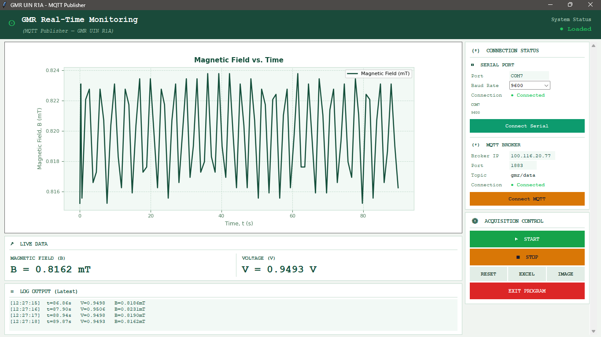

# GMR Sensor System [MORA-UIN]

Real-time Giant Magnetoresistance sensor system for calibrated magnetic field measurement. Two kit variants, Python GUIs, MQTT IoT interface, and machine learning pipelines — built with Arduino + ADS1115.



---

## Hardware Variants

| Variant | Series | Color | Developed At |
|---------|--------|-------|-------------|
| **GMR-UIN-R1A** | 1A | Blue | CV. Bolabot Techno Robotic Institute |
| **GMR-UIN-R1B** | 1B | Yellow | Lab. Fisika Material, UIN Bandung |

Identical in circuitry and firmware; differs only in series designation and enclosure color.

---

## Repository Structure

```
.
├── main.ino                         # Arduino firmware (ADS1115 reader)
├── magnetic_field_calibration.py    # Calibration script
├── output-template.xlsx             # Excel calibration template
│
├── GMR-UIN-R1A/                     # Blue kit
│   ├── GMR-UIN-R1A-Data-Acquisition.py
│   ├── src/                         # Calibration data, graphs
│   │   ├── r1a_calibration_report.xlsx
│   │   ├── r1a_calibration-graph.png
│   │   ├── r1a_regression-plot.png
│   │   ├── raw-data/                # (15 xlsx files, 1V–15V)
│   │   └── raw-b-data/              # (15 xlsx files, 1V–15V)
│   └── MQTT-interface/
│       ├── README.md
│       ├── 1.0.0/                   # Initial publisher & subscriber
│       ├── 1.0.0.f/                 # Feature-update patch
│       └── 1.1.0/                   # Latest patch
│
├── GMR-UIN-R1B/                     # Yellow kit
│   ├── GMR-UIN-R1B-Data-Acquisition.py
│   ├── src/
│   │   ├── r1b_calibration.png
│   │   ├── r1b_regression-plot.png
│   │   ├── r1b-calibration_report.xlsx
│   │   ├── raw_data/V_Helmholtz/    # (14 xlsx, 3V–16V)
│   │   └── raw-b-data/              # (13 xlsx, 3V–15V)
│   └── MQTT-interface/
│       ├── README.md
│       └── 1.1.0/                   # Publisher & subscriber
│
├── src/
│   ├── img/interface.png
│   ├── GMR-mechatronics.jpg
│   ├── manual-book-GMR-UIN-MORA.pdf
│   ├── schematic/                   # Schematics, PCB layout
│   └── docs/                        # Technical documentation
│
└── misc/
    ├── gui-prototype/               # 0.1.0 and 0.1.1 interface drafts
    └── machine-learning/
        ├── GMR_RF_glucose_monohydrate/          # RF regression (no GOx)
        ├── GMR_RF_GOx_Glucose Monohydrate/      # RF regression (with GOx)
        └── GMR_SVR-KNN-RF-Fe3O4/                # SVR / KNN / RF / LR models
```

---

## Quick Start

### 1. Arduino Firmware

Upload `main.ino` to your board. It reads the GMR sensor via ADS1115 (I²C) and outputs voltage over serial at 9600 baud.

### 2. Data Acquisition GUI

Pick your kit and run:

```bash
python GMR-UIN-R1A/GMR-UIN-R1A-Data-Acquisition.py   # Blue kit
python GMR-UIN-R1B/GMR-UIN-R1B-Data-Acquisition.py   # Yellow kit
```

### 3. Calibration

```bash
python magnetic_field_calibration.py
```

---

## MQTT Interface

Both kits support MQTT-based remote monitoring via publisher/subscriber modules. Multiple patch versions exist under each kit's `MQTT-interface/` directory. For Mosquitto broker setup and full documentation, refer to the respective `MQTT-interface/README.md`.

| Kit | Versions |
|-----|----------|
| R1A | `1.0.0`, `1.0.0.f`, `1.1.0` |
| R1B | `1.1.0` |

---

## Machine Learning

Pre-trained models for Fe₃O₄ classification/regression and glucose concentration prediction (with/without GOx enzyme) are available under `misc/machine-learning/`.

---

## Environment Setup

**Dependencies:** `pyserial`, `matplotlib`, `pandas`, `openpyxl`, `paho-mqtt`

```bash
pip install pyserial matplotlib pandas openpyxl paho-mqtt
```

Adjust the serial port in the acquisition script (`COM3` / `/dev/ttyUSB0`) to match your system.

---

## Acknowledgements

Funded by **MORA The Air Funds 2025** — Ministry of Religious Affairs, Republic of Indonesia, in collaboration with LPDP, Ministry of Finance (Contract No. 68/Dt.I.III/PP.05/12/2024 and B-2594/Un.05/V.2/HM.01/12/2024), awarded to Universitas Islam Negeri Sunan Gunung Djati Bandung (2025–2027).

---

## License

Refer to the documentation in this repository or contact the development team for licensing information.
