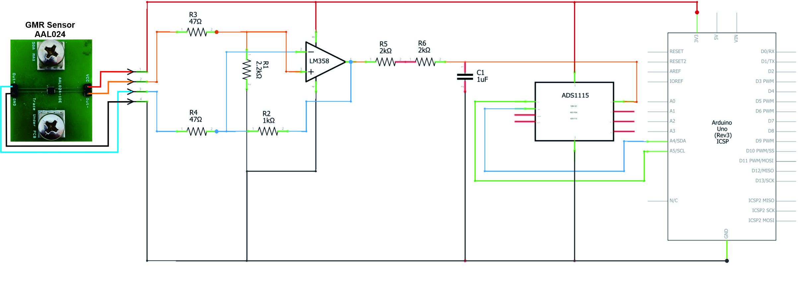
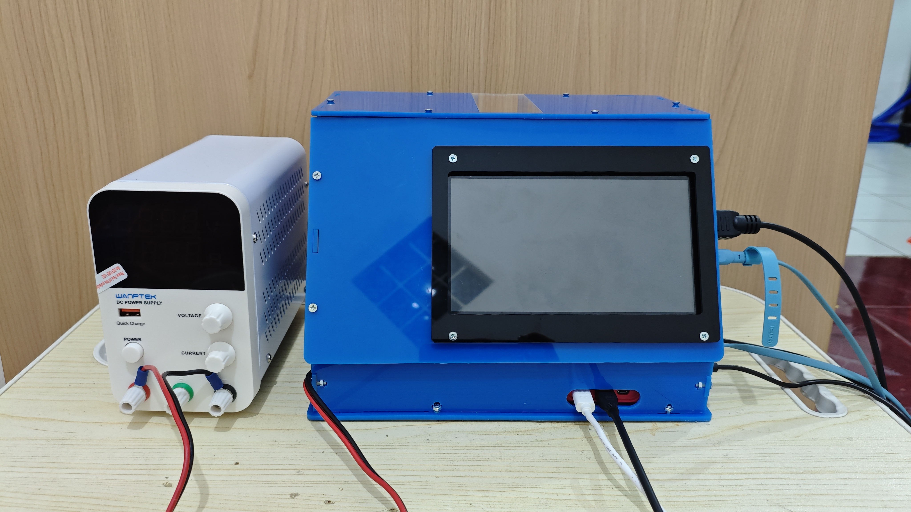

# GMR Sensor System [MORA-UIN]

Repositori ini mendokumentasikan sistem sensor magnetoresistif raksasa (GMR) yang dikembangkan untuk pengukuran medan magnet real-time. Proyek ini mencakup dua versi kit eksperimen, perangkat lunak akuisisi data terkalibrasi, hasil validasi, dan dokumentasi mekanis-elektris lengkap.

## Ringkasan Proyek

Sistem GMR Sensor System [MORA-UIN] dikembangkan sebagai alat penelitian dan kalibrasi medan magnet untuk aplikasi pendidikan dan laboratorium. Proyek ini terdiri dari:

- Versi pertama: `GMR-UIN-R1A` (biru), dikembangkan di CV. Bolabot Techno Robotic Institute.
- Versi kedua: `GMR-UIN-R1B` (kuning), dikembangkan di Laboratorium Fisika Material UIN Sunan Gunung Djati Bandung.
- Program Arduino utama: `main.ino` untuk kedua versi sistem.
- Alat kalibrasi: `magnetic_field_calibration.py` dan `output-template.xlsx`.
- Dokumentasi desain: skematik, desain mekatronika, buku manual, dan file desain PCB.

## Highlight Proyek

- Sistem GMR real-time dengan pengukuran medan magnet terkalibrasi.
- Dua versi kit eksperimen: R1A biru (CV. Bolabot Techno Robotic Institute) dan R1B kuning (Laboratorium Fisika Material UIN Bandung).
- Integrasi hardware Arduino + ADS1115 dengan perangkat lunak Python untuk GUI dan analisis.
- Dukungan validasi data dan dokumentasi lengkap untuk riset dan kalibrasi lapangan.
- Kompatibel dengan lingkungan Windows, Linux, dan Raspbian.
- Dokumentasi lengkap meliputi skematik elektronik, desain mekatronika, buku manual, dan desain PCB.

## Struktur Repositori

- `src/`
  - `GMR-mechatronics.jpg` — foto atau ilustrasi desain mekanika sistem.
  - `GMR-schematics.jpg` — gambar skematik rangkaian elektronik.
  - `manual-book-GMR-UIN-MORA.pdf` — buku manual penggunaan dan instalasi.
  - `print_PCB_GMR_AAL024-10E_Arduino.fzz` — desain PCB untuk pencetakan.
  - `print_PCB_GMR_AAL024-10E_Arduino_pcb.png` — tampilan layout PCB.
- `GMR-UIN-R1A/`
  - `GMR-UIN-R1A-Data-Acquisition.py` — perangkat lunak GUI Python terkalibrasi untuk akuisisi data medan magnet real-time.
  - `src/` — folder pendukung untuk R1A.
- `GMR-UIN-R1B/`
  - `GMR-UIN-R1B-Data-Acquisition.py` — perangkat lunak GUI Python terkalibrasi untuk akuisisi data medan magnet real-time.
  - `src/` — folder pendukung untuk R1B.
- `main.ino` — program Arduino utama untuk kedua versi sistem.
- `magnetic_field_calibration.py` — skrip kalibrasi utama dengan kemampuan analisis sensitivitas dan parameter kalibrasi.
- `output-template.xlsx` — template output kalibrasi/data yang digunakan bersama skrip kalibrasi.

## Desain Elektronik dan Mekatronika

### Skematik



Skematik ini menampilkan rangkaian pembacaan sensor GMR, konverter ADS1115, dan antarmuka serial ke Arduino. Komponen inti meliputi sensor GMR, modul ADS1115, serta komunikasi data ke host PC untuk akuisisi dan visualisasi.

### Desain Mekatronika



Desain mekanis membantu penempatan sensor, struktur fixturing, dan integrasi elemen elektronik di dalam kit eksperimen. Dokumentasi ini menunjukkan tata letak perangkat dan dukungan pengukuran stabil.

## Rincian Setiap Bagian

### 1. `src`

Folder `src` menyimpan dokumentasi teknis utama:
- Skematik rangkaian elektronik.
- Desain mekanika dan mekanotronika.
- Buku manual lengkap untuk pemasangan, pengujian, dan penggunaan sistem.
- File desain PCB untuk produksi dan validasi.

### 2. `GMR-UIN-R1A`

Versi pertama sistem, dikenal sebagai kit biru, dikembangkan di CV. Bolabot Techno Robotic Institute. Kodenya menyediakan GUI Python yang sudah terkalibrasi untuk pengukuran medan magnet secara real-time. Validasi dan protokol pengujian disimpan dalam struktur folder dan skrip di dalam direktori ini.

### 3. `GMR-UIN-R1B`

Versi kedua sistem, dikenal sebagai kit kuning, dikembangkan di Laboratorium Fisika Material UIN Sunan Gunung Djati Bandung. Perangkat lunak juga sudah terkalibrasi untuk akuisisi data real-time. Data eksperimen dan hasil validasi tersedia di folder ini.

### 4. `main.ino`

Program Arduino utama untuk kedua versi sistem. Sketch ini membaca tegangan output sensor dari modul ADS1115, mengubahnya menjadi data digital, dan mengirimkannya melalui serial ke host PC. File ini berfungsi sebagai firmware utama untuk platform Arduino.

### 5. `magnetic_field_calibration.py`

Skrip kalibrasi utama sistem sensor GMR. Program ini telah diaplikasikan di kedua versi kit, menyediakan metode kalibrasi yang viable untuk kit lanjutan. `output-template.xlsx` digunakan sebagai format output untuk data kalibrasi, hasil pengukuran, dan dokumentasi sensitivitas.

## Panduan Penggunaan Singkat

1. Hubungkan perangkat GMR ke komputer menggunakan Arduino yang menjalankan `main.ino`.
2. Jalankan salah satu skrip Python:
   - `GMR-UIN-R1A/GMR-UIN-R1A-Data-Acquisition.py`
   - `GMR-UIN-R1B/GMR-UIN-R1B-Data-Acquisition.py`
3. Pastikan port serial (`COM3` atau port lain) disesuaikan sesuai perangkat Anda.
4. Gunakan `magnetic_field_calibration.py` untuk analisis kalibrasi dan penyimpanan hasil ke template Excel.

> Catatan: Untuk menjalankan GUI akuisisi data, diperlukan Python dengan dependensi `pyserial`, `matplotlib`, `pandas`, dan `tkinter`.

## Persiapan Lingkungan

### Windows

1. Pasang Python 3.10+ dari https://www.python.org.
2. Buka PowerShell dan jalankan:
   ```powershell
   python -m pip install --upgrade pip
   python -m pip install pyserial matplotlib pandas openpyxl
   ```
3. Pastikan `tkinter` tersedia; biasanya sudah terpasang bersama Python resmi Windows.
4. Sesuaikan port serial di `GMR-UIN-R1A/GMR-UIN-R1A-Data-Acquisition.py`, `GMR-UIN-R1B/GMR-UIN-R1B-Data-Acquisition.py`, atau `main.ino` ke port Arduino yang digunakan.

### Linux / Raspbian

1. Perbarui paket sistem:
   ```bash
   sudo apt update
   sudo apt install python3 python3-pip python3-tk
   ```
2. Pasang dependensi Python:
   ```bash
   python3 -m pip install --upgrade pip
   python3 -m pip install pyserial matplotlib pandas openpyxl
   ```
3. Jalankan skrip Python dengan:
   ```bash
   python3 GMR-UIN-R1A/GMR-UIN-R1A-Data-Acquisition.py
   ```
4. Jika menggunakan Raspberry Pi, pastikan hak akses ke port serial telah diberikan, dan port `ttyUSB0` atau `ttyACM0` telah terdeteksi.

## Menjalankan Skrip

### Windows

- Buka PowerShell di folder repositori.
- Jalankan:
  ```powershell
  python GMR-UIN-R1A/GMR-UIN-R1A-Data-Acquisition.py
  ```
- Atau untuk versi kedua:
  ```powershell
  python GMR-UIN-R1B/GMR-UIN-R1B-Data-Acquisition.py
  ```
- Untuk kalibrasi:
  ```powershell
  python magnetic_field_calibration.py
  ```

### Linux / Raspbian

- Buka terminal di folder repositori.
- Jalankan:
  ```bash
  python3 GMR-UIN-R1A/GMR-UIN-R1A-Data-Acquisition.py
  ```
- Atau:
  ```bash
  python3 GMR-UIN-R1B/GMR-UIN-R1B-Data-Acquisition.py
  ```
- Untuk kalibrasi:
  ```bash
  python3 magnetic_field_calibration.py
  ```

## Acknowledgements

Penelitian ini didukung secara finansial oleh program MORA The Air Funds 2025 dari Kementerian Agama Republik Indonesia, bekerja sama dengan LPDP, Kementerian Keuangan, berdasarkan Kontrak No. 68/Dt.I.III/PP.05/12/2024 dan B-2594/Un.05/V.2/HM.01/12/2024, melalui hibah yang diberikan kepada Universitas Islam Negeri Sunan Gunung Djati Bandung untuk periode 2025–2027.

## Lisensi & Kontak

Silakan merujuk ke dokumentasi dalam repositori atau hubungi tim pengembang untuk informasi lisensi dan penggunaan lebih lanjut.